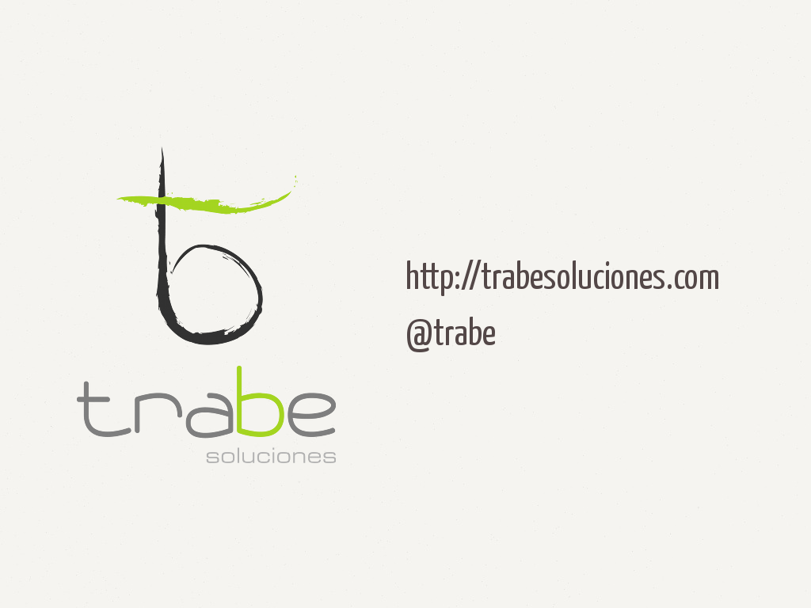
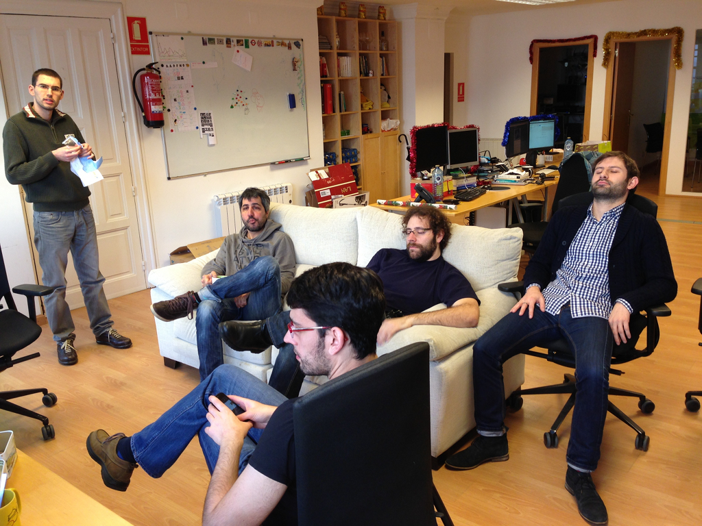
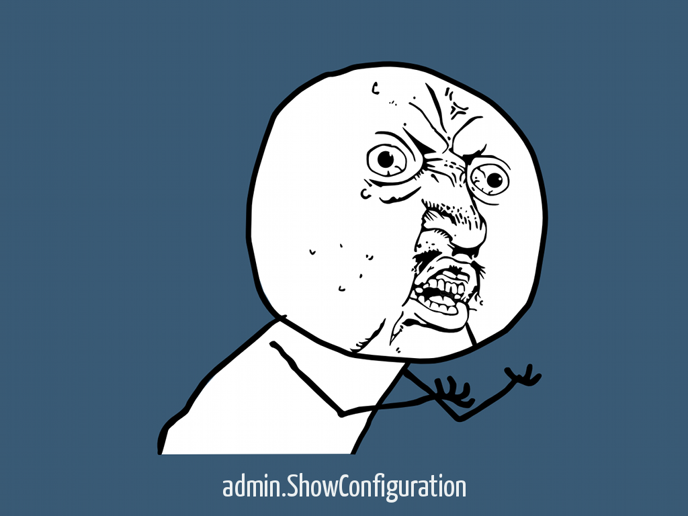
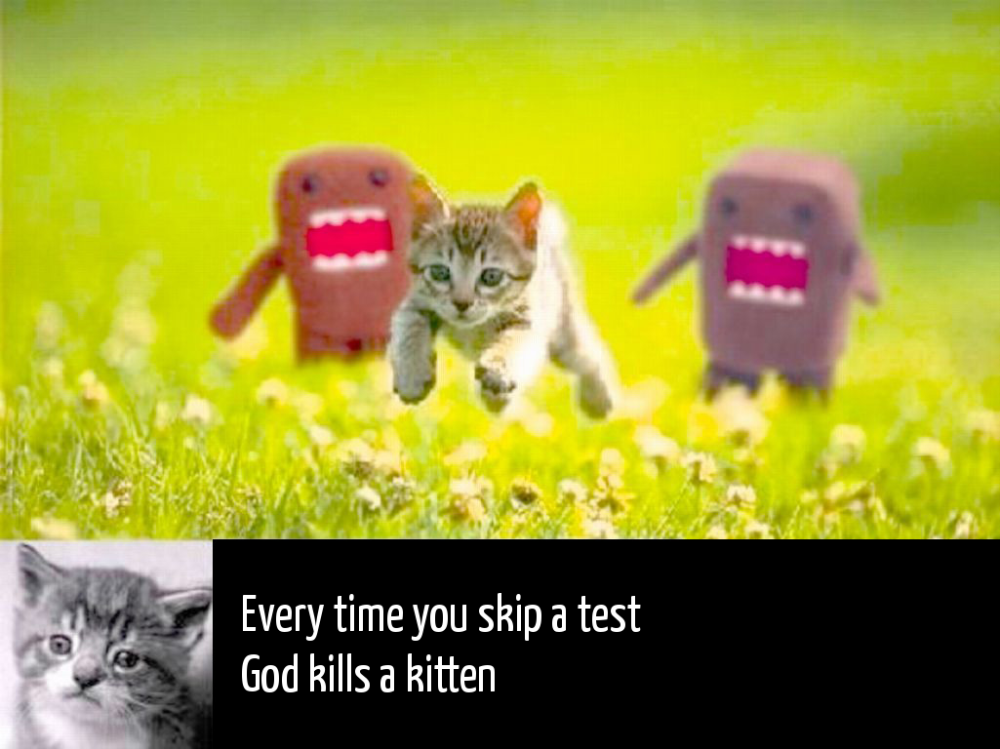

!SLIDE cover

# Surviving Software Development

!SLIDE image

!SLIDE image

<!--
  a qué nos dedicamos, qué hacemos para quién, tecnologías, etc
-->

!SLIDE image

!SLIDE

# Shiny happy opinionated people

!SLIDE bullets toc bullets-first

# Contents

* Ideas
* Tools
* Real life problems & solutions
* The many hells of Computer Science

!SLIDE section

# Ideas

!SLIDE quote

# A good design is easy to change, rather than easy to configure
## someone, somewhere

!SLIDE

# There is no silver bullet

## Every architecture/design solution has pros & cons

!SLIDE

# Architecture & technology should fit the problem

!SLIDE

# Simple is better

!SLIDE bullets columns

# Simple solutions are easier to:

* grasp
* design
* code
* document
* mantain
* evolve

!SLIDE

## Architecture: the UNIX way

# Orchestrate simple components, each doing one thing,  and doing it well

!SLIDE

# Design: SOLID rock

## KISS & DRY driven

<!--
son de OO pero aplicables a otro tipo de paradigmas
-->

!SLIDE

# S = Single Responsability
## A class should have only a single responsibility

!SLIDE

# O =  Open/Closed
## Open for extension. Closed for modification

!SLIDE

# L = Liskov Substitution
## objects in a program should be replaceable with  instances of their subtypes without altering the correctness of that program

!SLIDE

# I = Interface segregation
## Many client-specific interfaces are better than one general-purpose interface

!SLIDE
# D = Dependency inversion
## Depend upon Abstractions. Do not depend upon concretions (i.e. Dependency injection)

!SLIDE
# We are always SRP driven
# You should be too

!SLIDE

# SOLID leads to Design Patterns
## (Designs patterns are SOLID)

!SLIDE image

<!--
  Sigue lo SOLID y encapuslación y todo esto en cualquier lenguaje/paradigma que te irá mejor :D
-->

!SLIDE bullets bullets-first

# Other useful buzzwords

* YAGNI
* CoC

!SLIDE code smallest

    @@@ xml
    <action path="/admin/ShowConfiguration"
      type="controller.admin.ShowConfigurationAction"
      scope="request">
      <forward name="success" 
               path=".admin.ShowConfiguration"/>
    </action>

!SLIDE image

!SLIDE bullets columns title-first

# TEST, TEST, TEST

* TDD, BDD
* Regresions
* Benchmarks
* DI
* Refactoring
* CI

!SLIDE bullets title-first chain-bullets

# TEST, TEST, TEST

* Complex test
* &#x2193;
* Bad design
* &#x2193;
* Refactor & DI
* &#x2193;
* Better design. Better API

<!--
  DI -> Dependency Injection
  Test complicado <-> código mal diseñado
  Test -> Definir el api desde el punto de vista del "cliente"
  Statist vs Mockist (Mock what you own)
-->

!SLIDE image

