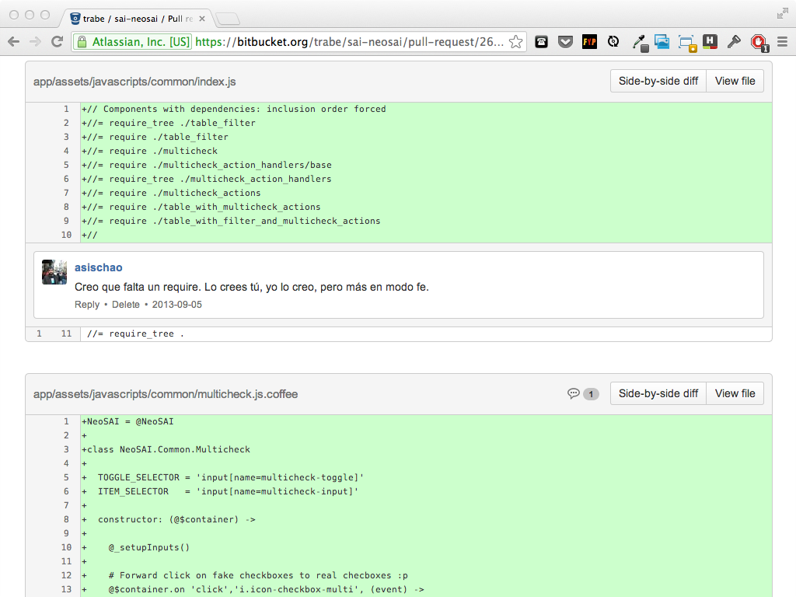
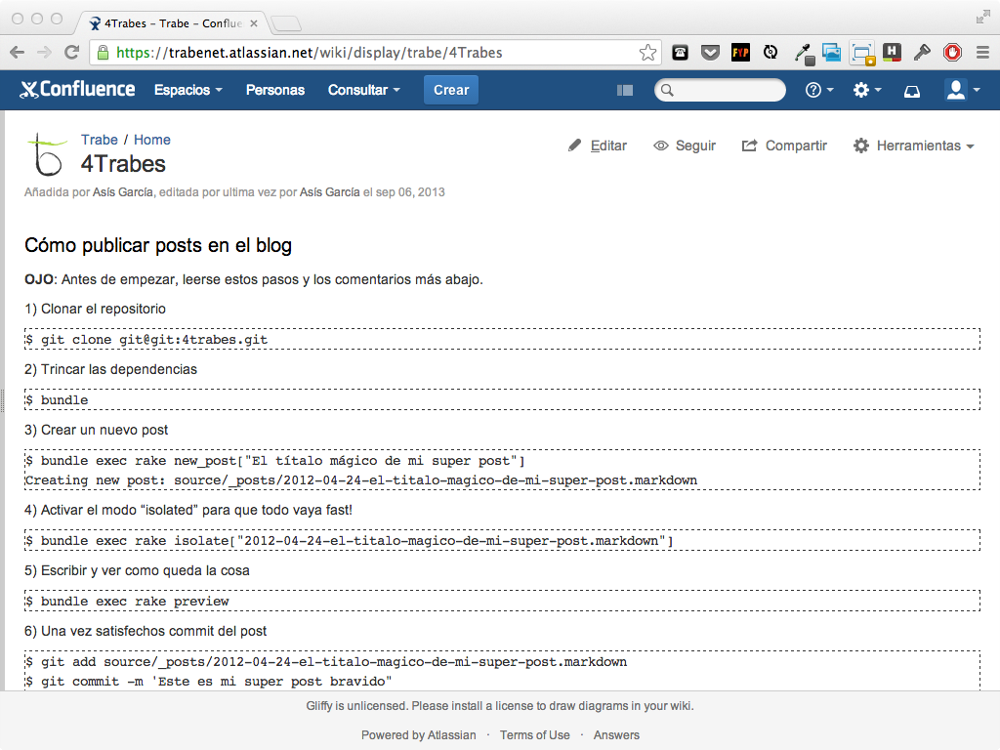

!SLIDE section

# Tools

!SLIDE

# The Trábico process

## Agile, sort of __: )__

!SLIDE

# Tools
## Continous improvement, most of the time __: )__

!SLIDE bullets title-first
# Project development

* TDD
* Code reviews
* Pair programming

<!--
  Code review: presencial vs Bitbucket
  Pair programming: problemas chungos, formación, cansancio y ganas de no hacer nada a solas xD
-->

!SLIDE image

!SLIDE image

<!--
  Hablar de gitflow vs githubflow
-->

!SLIDE image

!SLIDE image

!SLIDE image

<!--
  Diffs y comentarios permiten code reviews asíncronas y remotas
-->

!SLIDE image

<!--
  Compartir conocimiento. Preferir que el conocimiento específico 
  esté como parte del README del proyecto o similar.
-->

!SLIDE bullets bullets-first

* conventions
* automation
* scripts
* bootstrap

<!--
  Enforcing de convenciones de código comunes, etc. Entornos parecidos, herramientas y plugins comunes. .dotfiles en github
  Automatización de todo lo posible, setup, despliegue, tareas de mantenimiento
  Hacemos scripts. -> Repositorio de scripts compartido
  Facilitar el bootstrap del proyecto: README + script setup
-->

!SLIDE code small terminal

    @@@
    $ git clone trabe:awesome-project
    $ cd awesome-project
    $ ./bin/setup

!SLIDE bullets title-first
# TESTs, TESTs, TESTs

* Automatic run (guard)
* Mocking
* Metrics (coverage)

<!--
  Tests guiados por mocks, llevan al buen diseño
  Mock, Factorias, Mock de 3rd parties, coverage
  ¿¿Mockists vs State-ist??
  Deberíamos tener CI  (-_- U)
-->

!SLIDE bullets title-first
# Conveniences

* Transpilers: CoffeScript, SASS, etc.
* Debugging tools
* Live Reload. YAY!

<!--
  En función de la tecnología usamos herramientas
  transpilers: escritura eficiente. Ojo al debug
  mezclar: ej. sprokets + SASS en J2EE
-->

!SLIDE image

!SLIDE image

!SLIDE image

