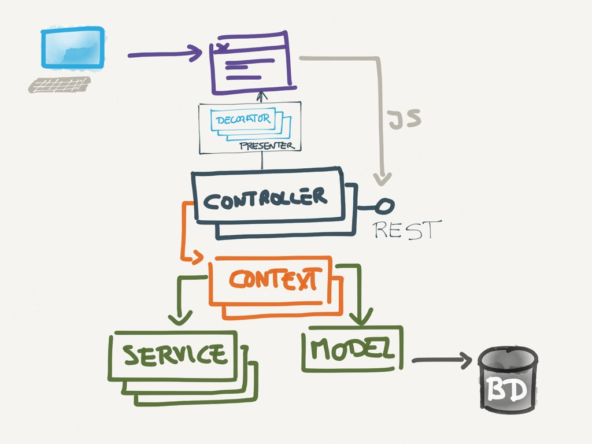
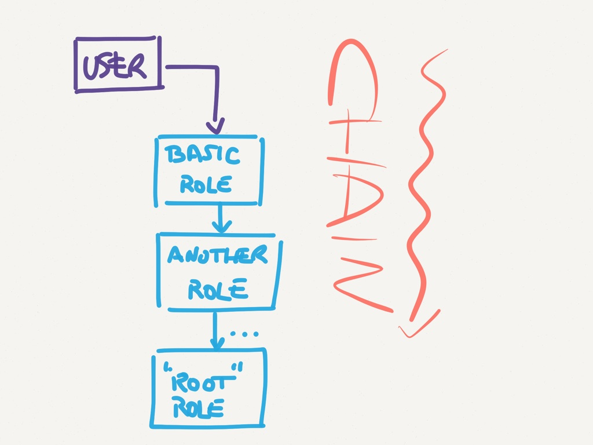
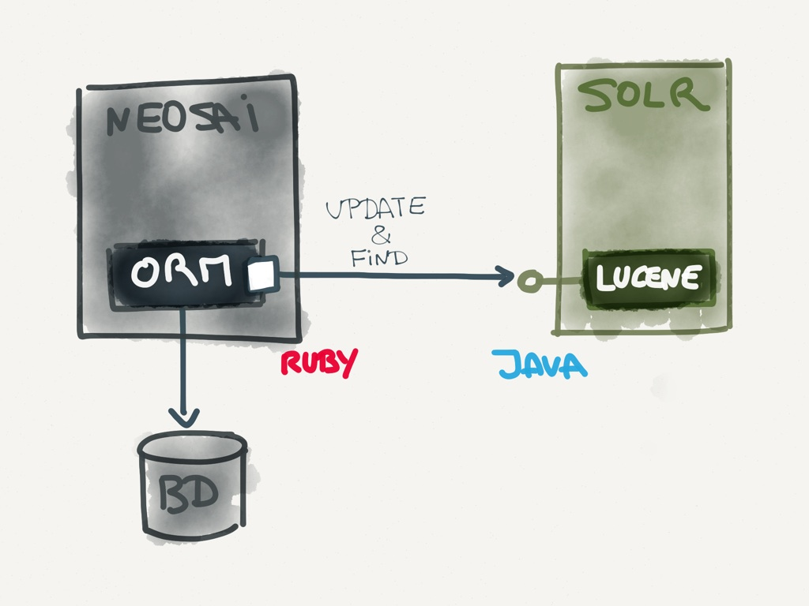

!SLIDE section

# Real life problems & solutions

!SLIDE

## Context
# NeoSAI
## A Laboratory Management System

!SLIDE image

<!--
  También hay serializadores: decoradores específicos :D
-->

!SLIDE problem

# Problem

## Different kinds of UIs

!SLIDE solution bullets wide-bullets

# Solution

* Basic CRUD: forms & listings
* Advanced CRUD: JS components + AJAX
* Complex tasks: Single-page app + REST

!SLIDE bullets title-first

# WTF are REST APIs?

* Theory duh, duh, duh (and more bullshit)
* Practice way to comunicate apps/systems through HTTP

!SLIDE bullets title-first

# WTF are REST APIs?

* URIs
* HTTP verbs
* HTTP Status codes
* JSON params/response (or XML or whatever)

!SLIDE code small

## GET https://api.twitter.com/1/users/show.json?screen_name=trabe

    @@@ javascript

      {
        "id": 6253282,
        "name": "Trabe",
        "location": "A Coruña, Spain",
        "followers_count": 3000000
        ...
      }

!SLIDE problem

# Problem

## Run the same business logic from different places

!SLIDE solution

# Solution

## Context objects
## Runnable from app controllers, API controllers, cron jobs

!SLIDE code small

    @@@ ruby
    class CreateUserContext
      def initialize(user_params, notifier)
        ...
      end

      def run
        user = User.new(user_params)
        if user.save
          notifier.send(:new_user, user)
        end
      end
    end

!SLIDE problem

# Problem

## Run business logic as different users, even as no user

!SLIDE solution bullets

# Solution

* Context objects
* Runnable as user
* NullUser (NullObject pattern)

!SLIDE bullets title-first

# NullObject pattern

* Remove branching logic
* Avoid null errors
* Improves testability

<!-- No ramas -> menos tests -> SRP -->

!SLIDE code smallest

    @@@ coffeescript
        class User
          constructor : (name) ->
            this.name = name

        greet = (user) ->
          if user
            alert "Hi #{user.name}!"
          else
            alert "Hi stranger!"

        john = new User('John')
        keith = null

        greet john    # Hi John!
        greet keith   # Hi stranger!

!SLIDE code smallest

    @@@ coffeescript
        class User
          constructor : (name) ->
            this.name = name

        class Stranger extends User
          constructor : ->
            super 'stranger'

        greet = (user) ->
          alert "Hi #{user.name}!"

        john = new User('John')
        keith = new Stranger()

        greet john    # Hi John!
        greet keith   # Hi stranger!

!SLIDE problem

# Problem

## Complex permission checks

!SLIDE quote

# Can change a report if I am the author or its author is one of my subordinates and the report has not been signed
## the customer

!SLIDE solution

# Solution

## Policy objects

!SLIDE code small

    @@@ ruby

    class ReportsController
      def edit
        report = Report.find(params[:id])
        can_edit = ReportEditorPolicy.
          new(current_user, report).comply?
        ...

!SLIDE code small

    @@@ ruby
    class ReportEditorPolicy < Policy
      def initialize(user, report)
        ...
      end

      def comply?
        (owner_of_report? or
        subordinate_report?) and
        unsigned_report?
      end

      ...

!SLIDE problem

# Problem

## User role based behaviour

!SLIDE solution bullets

# Solution

* Inject user with  role dependent methods
* State pattern (sort of)

!SLIDE image

!SLIDE problem
# Problem
## Present same model object in different ways on different views

!SLIDE solution bullets
# Solution

* Decorator pattern
* Decorate associations too
* One or multiple decorators
* Variant: presenter pattern

<!--
  Recomentar as needed lo de los serializadores :D
-->

!SLIDE code smallest

    @@@ ruby
    class User
      def initialize(name, email)
        ...
      end
    end

    class UserDecorator
      def initialize(user)
        ...
      end

      def name
        user.name
      end

      def email
        user.name + "<" + user.email + ">"
      end
    end

!SLIDE code small

    @@@ ruby
    user = User.new('john', 'john@mail.com')
    decorated_user = UserDecorator.new(user)
    mail = new Mail()

    mail.send to: decorated_user.email

!SLIDE problem

# Problem
## Global search

!SLIDE solution bullets

# Solution
* External Indexer (REST API)

!SLIDE image

<!--
  Ventaja: transparencia, independencia de BD
  Problema: transaccionalidad
-->

