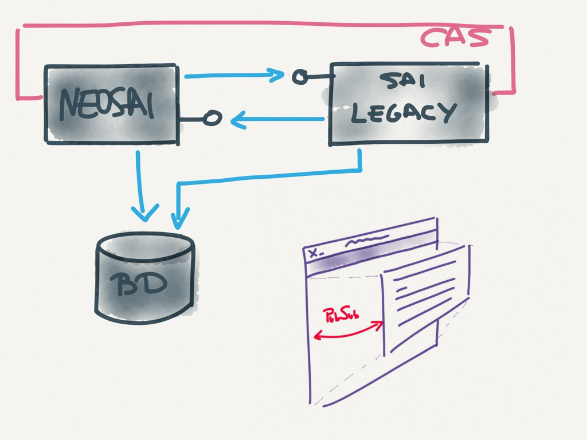

!SLIDE section

# Real life examples

!SLIDE section

# FEDERICO

<!--
Ejemplo de arquitectura para integrar múltiples aplicaciones
-->

!SLIDE problem

# Problem

## Signup/signin on multiple services
## Consolidate personal info

!SLIDE solution bullets bullets-first

# Solution

* Procedure repository
* Orchestrate services (Service Bus)
* Single Sign On

!SLIDE image

<!--
Solución ideal:
Federacion de autenticacion
Bus + Pull+Push + Operaciones WS
Webs diferentes tecnologías consumen WS
-->

!SLIDE image

<!--
Solución de compromiso
Sólo Pull, Tareas periódicas para push
Adaptadores: BD, LDAP, WS, Comandos SSH, etc.

RObot de keystroke xDDDD :p
-->

!SLIDE bullets bullets-first

# Technology

* Java stack
* Ruby for automation

<!--
Herramientas de build y despliegue específicas: Rake
-->

!SLIDE section

# NeoSAI

!SLIDE problem

# Context

## Laboratory Management System

!SLIDE image

<!--
  También hay serializadores: decoradores específicos :D
-->

!SLIDE problem

# Problem

## Different kinds of UIs

!SLIDE solution bullets wide-bullets

# Solution

* Basic CRUD: forms & listings
* Advanced CRUD: JS components + AJAX
* Complex tasks: Single-page app + REST

!SLIDE problem

# Problem

## Integrate new & legacy app

!SLIDE solution bullets wide-bullets

# Solution

* Shared DB
* REST APIs (JSON preferred)
* SSO
* UI integration via IFrame + HTML5 PubSub

!SLIDE image

<!--
  Ojo al consumo bidireccional de APIses
-->

!SLIDE problem

# Problem

## Integrate "nonintegrable"  third party software

!SLIDE solution bullets

# Solution

* Ad hoc REST API
* Mail vacuums

!SLIDE image

!SLIDE problem

# Problem

## Mail log: different sources

!SLIDE solution

# Solution

## Wrapper + REST API

!SLIDE image

<!--
  ventaja, no tenemos que tocar las aplicaciones, SRP
  desventaja, rendimiento, alternativa: interceptar el envío
  desde la librería (dos intercepciones diferentes :c )
-->

!SLIDE problem

# Problem

## Complex permission checks

!SLIDE quote

# Can change a report if I am the author or its author is one of my subordinates and the report has not been signed
## the customer

!SLIDE solution

# Solution

## Policy objects

!SLIDE code small

    @@@ ruby

    class ReportsController
      def edit
        report = Report.find(params[:id])
        can_edit = ReportEditorPolicy.
          new(current_user, report).comply?
        ...

!SLIDE code small

    @@@ ruby
    class ReportEditorPolicy < Policy
      def initialize(user, report)
        ...
      end

      def comply?
        (owner_of_report? or
        subordinate_report?) and
        unsigned_report?
      end

      ...

!SLIDE problem

# Problem

## Run the same business logic from different places

!SLIDE solution

# Solution

## Context objects
## Runnable from controllers, console, APIs, cron jobs

!SLIDE code small

    @@@ ruby
    class CreateUserContext
      def initialize(user_params, notifier)
        ...
      end

      def run
        user = User.new(user_params)
        if user.save
          notifier.send(:new_user, user)
        end
      end
    end

!SLIDE problem

# Problem

## Run business logic as different users, even as no user

!SLIDE solution bullets

# Solution

* Context objects
* Runnable as user
* NullUser (NullObject pattern)

!SLIDE bullets title-first

# NullObject pattern

* Remove branching logic
* Avoid null errors
* Improves testability

<!-- No ramas -> menos tests -> SRP -->

!SLIDE code smallest

    @@@ coffeescript
    class User
      constructor : (name) ->
        this.name = name

    greet = (user) ->
      if user
        alert "Hi #{user.name}!"
      else
        alert "Hi stranger!"

    john = new User('John')
    keith = null

    greet john    # Hi John!
    greet keith   # Hi stranger!

!SLIDE code smallest

    @@@ coffeescript
    class User
      constructor : (name) ->
        this.name = name

    class Stranger extends User
      constructor : ->
        super 'stranger'

    greet = (user) ->
      alert "Hi #{user.name}!"

    john = new User('John')
    keith = new Stranger()

    greet john    # Hi John!
    greet keith   # Hi stranger!

!SLIDE problem

# Problem

## Limit data access based on user roles

!SLIDE solution bullets

# Solution

* Inject user with role dependent methods to access the model
* Similar to State pattern (sort of)

!SLIDE image

!SLIDE
# DCI

## Data, Context, Interaction

<!--
Llegamos a la arquitectura a través de mirar el DCI
explicar el DCI con ejemplo de transferencia entre cuentas (con diag)
No lo usamos tal cual por limitaciones tecnológicas.
-->

!SLIDE code small

    @@@ ruby
    class BankAccount
      attr_accessor :balance
    end

    module TransferSource
      def withdraw(amount)
        self.balance -= amount
      end
    end

    module TransferTarget
      def deposit(amount)
        self.balance += amount
      end
    end

!SLIDE code small

    @@@ ruby
    class TransferContext
      def initialize(source, target, amount)
        ...
      end

      def run
        source.extends TransferSoure
        target.extends TransferTarget

        source.withdraw amount
        target.deposit amount
      end
    end

!SLIDE bullets title-first many-bullets

# DCI

* SRP
* Reusability
* Testability
* Best with dynamic langs
* Beware of implementation quirks

!SLIDE problem
# Problem
## Present same model object in different ways on different views

!SLIDE solution bullets
# Solution

* Decorator pattern
* Decorate associations too
* One or multiple decorators
* Variant: presenter pattern

<!--
  Recomentar as needed lo de los serializadores :D
-->

!SLIDE code smallest

    @@@ ruby
    class User
      def initialize(name, email)
        ...
      end
    end

    class UserDecorator
      def initialize(user)
        ...
      end

      def name
        user.name
      end

      def email
        user.name + "<" + user.email + ">"
      end
    end

!SLIDE code small

    @@@ ruby
    user = User.new('john', 'john@mail.com')
    decorated_user = UserDecorator.new(user)
    mail = new Mail()

    mail.send to: decorated_user.email

!SLIDE problem

# Problem
## Global search

!SLIDE solution bullets

# Solution
* External Indexer (REST API)

!SLIDE image

<!--
  Ventaja: transparencia, independencia de BD
  Problema: transaccionalidad
-->

!SLIDE problem

# Problem
## Long running contexts

!SLIDE solution bullets

# Solution
* Execute contexts in background
* Jobs queues
* Jobs executor

!SLIDE image

<!--
  Escalabilidad
  Linealizar tiempo de respuesta de la app
  Problema: persistencia de jobs. Gestión de error/repetición.
    Infraestructura para recupearar los resultados
-->
