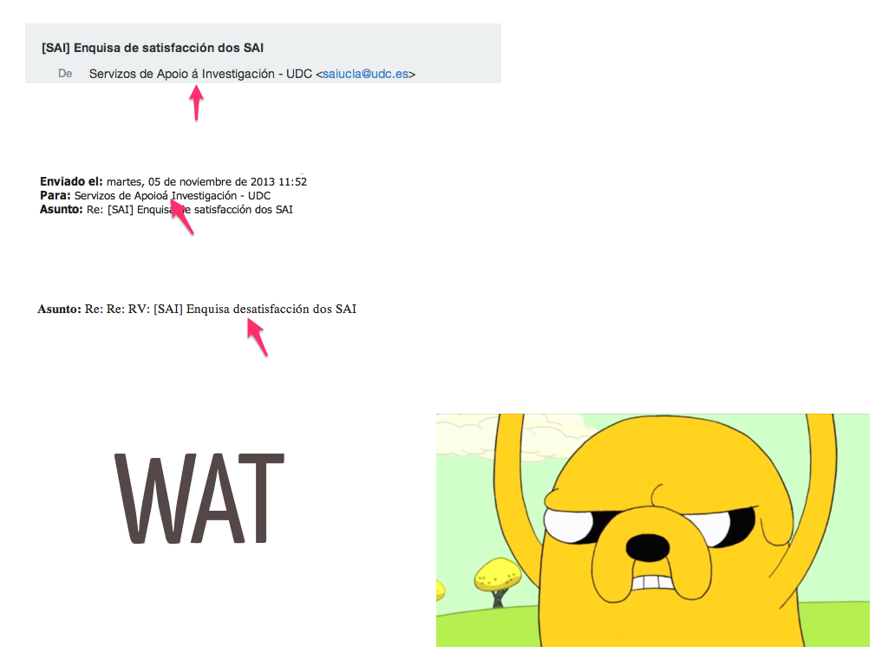
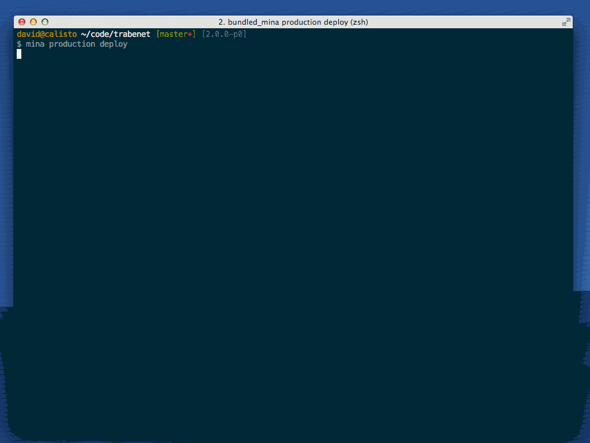
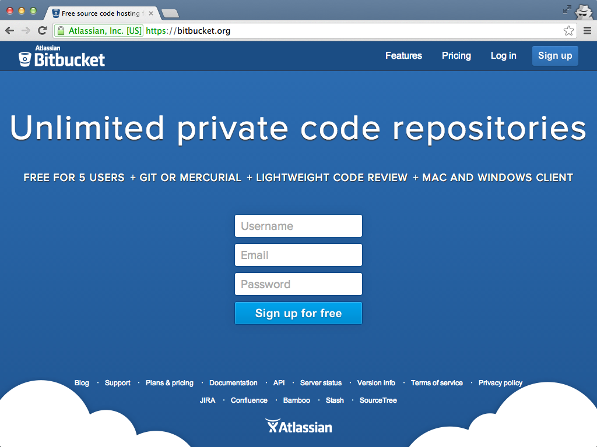
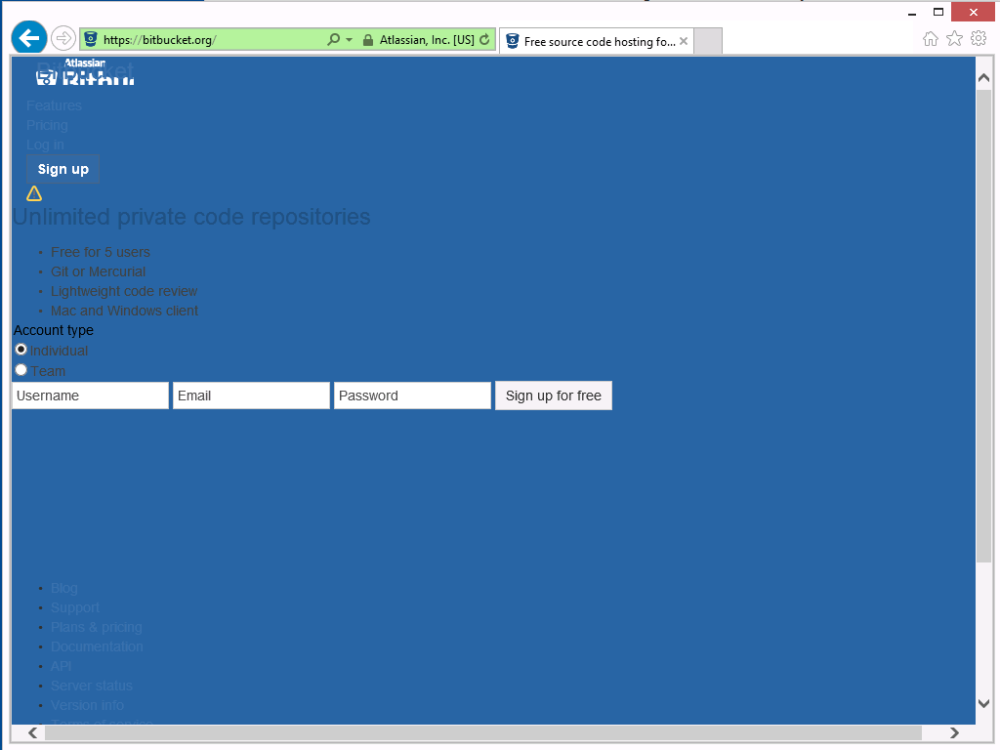
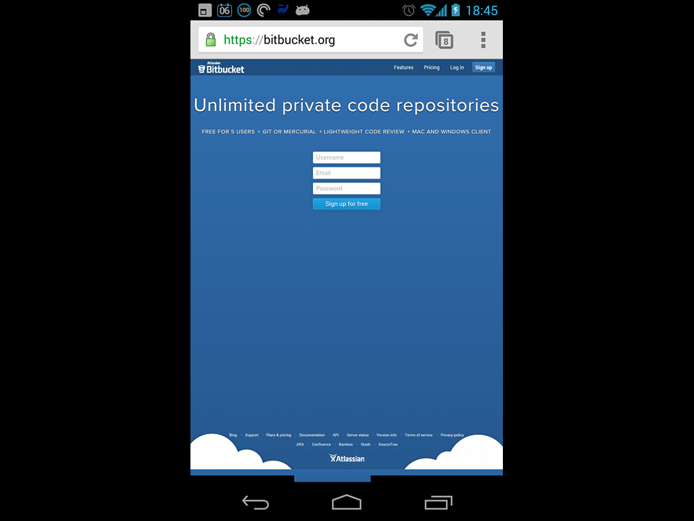

!SLIDE section

# The many hells of Computer Science

<!-- you can explain that -->

!SLIDE quote

# There are only two hard things in Computer Science: cache invalidation and naming things.
## Phil Karlton

!SLIDE

# Easy cache invalidation

## LRU Caches + Auto expiring keys

!SLIDE code small

      @@@ ruby

      class User
        def cache_key
          "user#" + id + "#" +
            updated_at.to_millis
        end
      end

      cache user.cache_key do
        ...
      end

!SLIDE

# Easy naming

## There is no easy naming. Sorry folks!

!SLIDE image

!SLIDE

# Maybe there are more hard things

!SLIDE image

!SLIDE

# Encoding hell

## Use UTF-8. Use iconv wisely

!SLIDE image

!SLIDE image

<!--
  Ejemplo de cosa incontrolable
-->

!SLIDE image

!SLIDE

# Timezones, i18n, l11n, Accessibility hell

## Always use UTC (beware of qwirks) __:D__
## Treat i18n, l11n and accesibility as first class citizens

!SLIDE code smallest

      @@@ ruby

      # DB stores UTC. Conversion done by Rails
      r = Report.first
      r.created_at # => 2013-11-06 00:00:00 +0100
      r.created_at.utc # => 2013-11-05 23:00:00 UTC

      Report.where('DATE(created_at) = ?', 
        r.created_at.to_date)

      # Ooooopppps!
      #
      #  SELECT * FROM reports
      #  WHERE (DATE(created_at) = '2013-11-06')

<!--
  Ejemplo de cosa controlable
-->

!SLIDE

# A test should have detected the defect __;)__

!SLIDE

# The money hell
## Beware of spanish taxes and accounting
## Use f**king cents

!SLIDE

# The money hell  a.k.a the floating point hell
## Stick to integers. Use fixed point

<!--
  Floats are fast in today CPUs an acceptable for
  a lot of things (i.e. 3D graphics), but not for
  money. For money you need 100% accurate numeric types
-->

!SLIDE image

!SLIDE

# Deployment and environments hell

## Define enviroments from square one
## Automatize deployment as much as you can

!SLIDE image

!SLIDE

# Migration hell

## Data evolves along your code
## Use some way of control/script/automate migrations
## i.e RoR migrations, Flyway for Java

!SLIDE code smallest

    @@@ ruby

    add_column :invoices, :report_id, :integer

    Invoices.find_each do |invoice|
      order = Order.where(number: invoice.order_number)
      invoice.order = order
    end

!SLIDE

# Beware of data massaging
## Either complex or simple __¬¬__

!SLIDE code smallest

    @@@ ruby

    add_column :invoices, :report_id, :integer

    Invoices.find_each do |invoice|
      order = Order.where(number: invoice.order_number)

      raise "Fuck" if order.client_id != invoice.client_id

      invoice.order = order
    end

!SLIDE

# Documentation/Code sync hell

## Self explanatory code
## Document APIs
## Document wisely
## Treat documentation as part of the code

!SLIDE code smallest

    @@@ java

    /**
     * Returns the user names in alphabetical order
     * @returns the names
     */
    public String[] orderedNames() {
      return sortAlphabetically(this.getNames());
    }

    /*
     * Sort with quicksort algorithm
     */
    private String[] sortAlphabetically(String[] words) {
      // lines of elegant yet uninteligible code ;)
    }

!SLIDE

# Multithreading hell

## Use multi process
## Avoid too much low level

!SLIDE bullets bullets-first

# Inter Process Communication

* Unix Sockets
* Queues
* Shared memory

!SLIDE

# Or use a library!
# Or switch to erlang :P

!SLIDE bullets title-first

# Fragmentation hell

* Do your HTML5/CSS3/JS homework
* SOLID also applies (SMACSS, etc)
* Know how to tame browsers
* Know how to tame mobile

!SLIDE image

!SLIDE image

!SLIDE image

!SLIDE

# MVC Inception

## Inside an webapp MVC there is another MVC

!SLIDE section

# Parting note

!SLIDE bullets title-first chain-bullets
# SOLID (SRP in particular)

* &#x2193;
* Simple
* &#x2193;
* Easy to change
* &#x2193;
* Happiness __\\(^o^)/__

!SLIDE bullets title-first chain-bullets
# YAGNI

* &#x2193;
* Simple
* &#x2193;
* Easy to change
* &#x2193;
* Happiness __\\(^o^)/__

!SLIDE bullets title-first chain-bullets

# TESTs, TESTs, TESTs

* &#x2193;
* YAGNI + SOLID
* &#x2193;
* Simple
* &#x2193;
* Easy to change
* &#x2193;
* Happiness __\\(^o^)/__

!SLIDE bullets title-first chain-bullets

# Refactor, Refactor, Refactor
##(code and tests)

* &#x2193;
* Better code & tests
* &#x2193;
* ... 
* &#x2193;
* Happiness __\\(^o^)/__

!SLIDE

# DRY more than your code

## Automatize, share, extract

!SLIDE

## The most important commandment

# Do what feels right!

<!-- EJemplo de Twitter y ; -->
