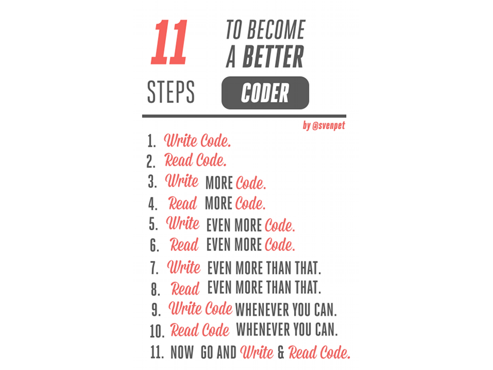

!SLIDE section

# Parting note

!SLIDE bullets title-first chain-bullets
# SOLID (SRP in particular)

* &#x2193;
* Simple
* &#x2193;
* Easy to change
* &#x2193;
* Happiness __\\(^o^)/__

!SLIDE bullets title-first chain-bullets
# YAGNI

* &#x2193;
* Simple
* &#x2193;
* Easy to change
* &#x2193;
* Happiness __\\(^o^)/__

!SLIDE bullets title-first chain-bullets

# TESTs, TESTs, TESTs

* &#x2193;
* YAGNI + SOLID
* &#x2193;
* Simple
* &#x2193;
* Easy to change
* &#x2193;
* Happiness __\\(^o^)/__

!SLIDE bullets title-first chain-bullets

# Refactor, Refactor, Refactor
##(code and tests)

* &#x2193;
* Better code & tests
* &#x2193;
* ... 
* &#x2193;
* Happiness __\\(^o^)/__

!SLIDE

# DRY more than your code

## Automatize, share, extract

!SLIDE image

