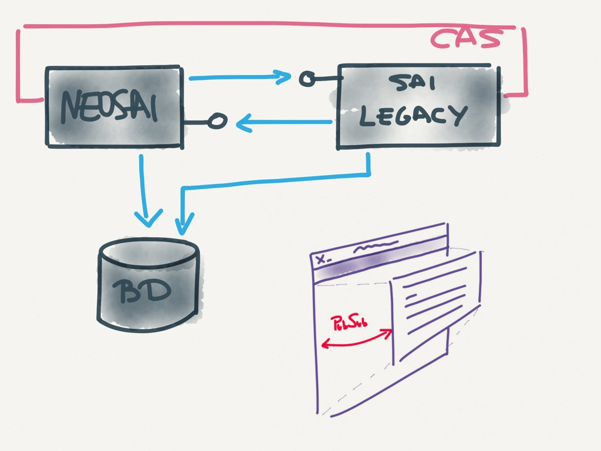
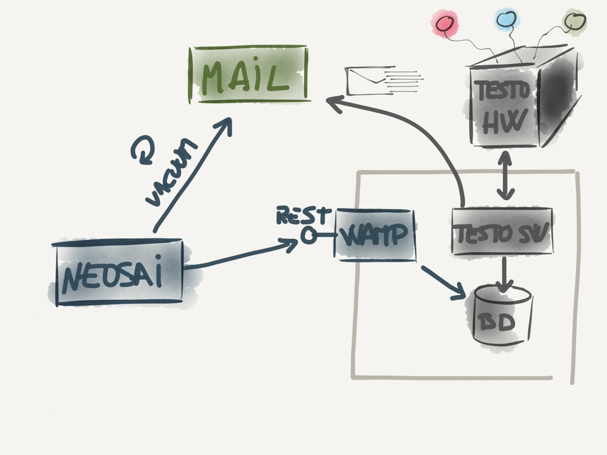
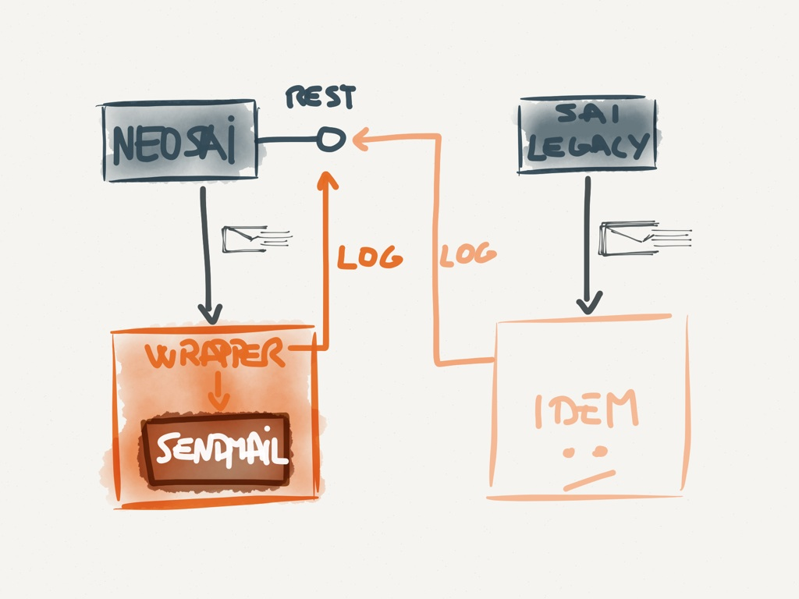
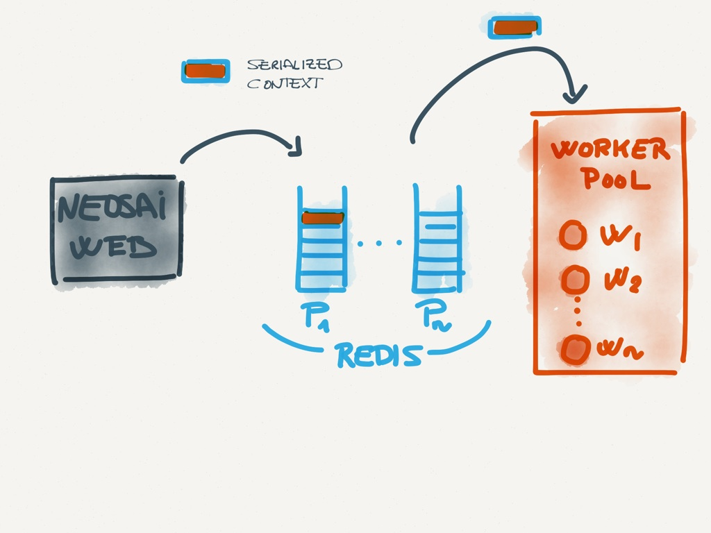
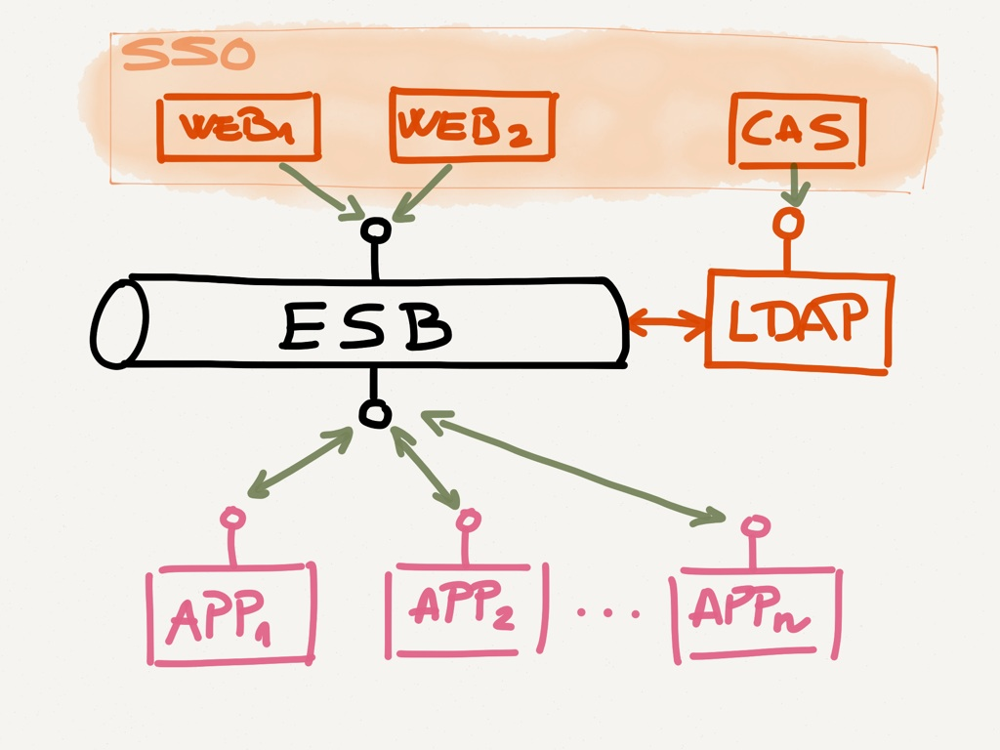
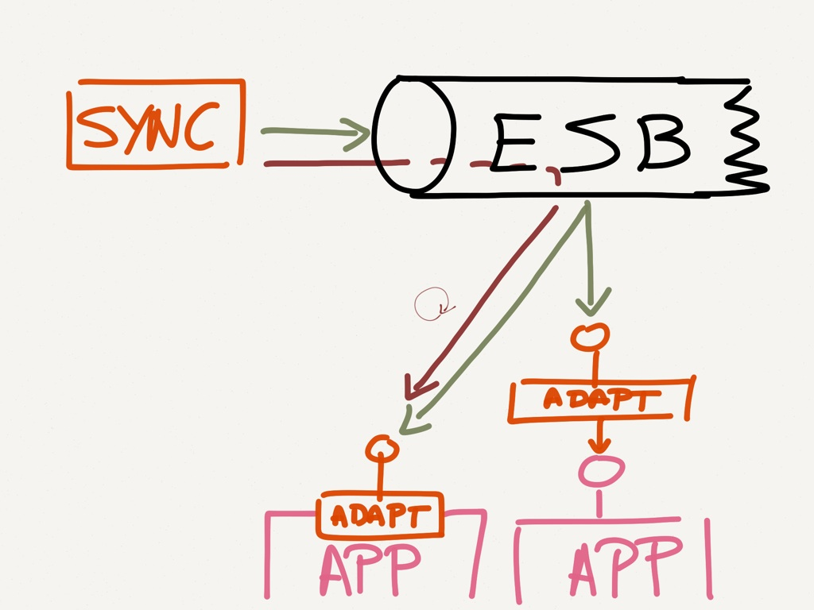

!SLIDE 

# .

!SLIDE

# ..

!SLIDE

# ...

!SLIDE section

# Encore
## It's up to you

!SLIDE section

# More real life problems & solutions

!SLIDE section

# More about NeoSAI
## the Laboratory Management System

!SLIDE problem

# Problem

## Integrate new & legacy app

!SLIDE solution bullets wide-bullets

# Solution

* Shared DB
* REST APIs (JSON preferred)
* SSO
* UI integration via IFrame + HTML5 PubSub

!SLIDE image

<!--
  Ojo al consumo bidireccional de APIses
-->

!SLIDE problem

# Problem

## Integrate "nonintegrable"  third party software

!SLIDE solution bullets

# Solution

* Ad hoc REST API
* Mail vacuums

!SLIDE image

!SLIDE problem

# Problem

## Mail log: different sources

!SLIDE solution

# Solution

## Wrapper + REST API

!SLIDE image

<!--
  ventaja, no tenemos que tocar las aplicaciones, SRP
  desventaja, rendimiento, alternativa: interceptar el envío
  desde la librería (dos intercepciones diferentes :c )
-->

!SLIDE problem

# Problem
## Long running contexts

!SLIDE solution bullets

# Solution
* Execute contexts in background
* Jobs queues
* Jobs executor

!SLIDE image

<!--
  Escalabilidad
  Linealizar tiempo de respuesta de la app
  Problema: persistencia de jobs. Gestión de error/repetición.
    Infraestructura para recupearar los resultados
-->

!SLIDE section

# FEDERICO
## Application integration
## a.k.a. real life hitting your groin

<!--
Ejemplo de arquitectura para integrar múltiples aplicaciones
-->

!SLIDE problem

# Problem

## Signup/signin on multiple services
## Consolidate personal info

!SLIDE solution bullets bullets-first

# Solution

* Procedure repository
* Orchestrate services (Service Bus)
* Single Sign On

!SLIDE image

<!--
Solución ideal:
Federacion de autenticacion
Bus + Pull+Push + Operaciones WS
Webs diferentes tecnologías consumen WS
-->

!SLIDE image

<!--
Solución de compromiso
Sólo Pull, Tareas periódicas para push
Adaptadores: BD, LDAP, WS, Comandos SSH, etc.

RObot de keystroke xDDDD :p
-->

!SLIDE bullets bullets-first

# Technology

* Java stack
* Ruby for automation

<!--
Herramientas de build y despliegue específicas: Rake
-->

!SLIDE section
# DCI

## Data, Context, Interaction

<!--
Llegamos a la arquitectura a través de mirar el DCI
explicar el DCI con ejemplo de transferencia entre cuentas (con diag)
No lo usamos tal cual por limitaciones tecnológicas.
-->

!SLIDE code small

    @@@ ruby
    class BankAccount
      attr_accessor :balance
    end

    module TransferSource
      def withdraw(amount)
        self.balance -= amount
      end
    end

    module TransferTarget
      def deposit(amount)
        self.balance += amount
      end
    end

!SLIDE code small

    @@@ ruby
    class TransferContext
      def initialize(source, target, amount)
        ...
      end

      def run
        source.extends TransferSoure
        target.extends TransferTarget

        source.withdraw amount
        target.deposit amount
      end
    end

!SLIDE bullets title-first many-bullets

# DCI

* SRP
* Reusability
* Testability
* Best with dynamic langs
* Beware of implementation quirks

!SLIDE image

